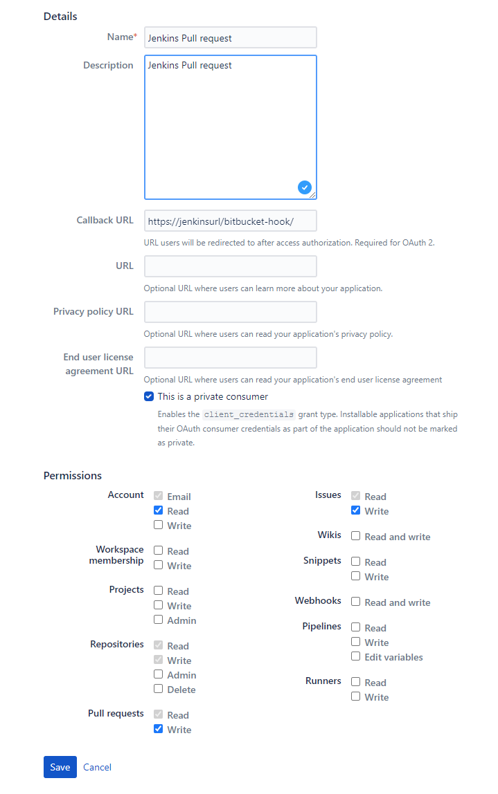
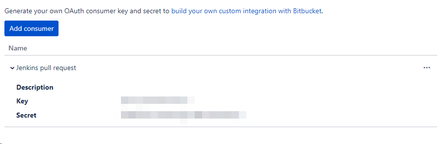
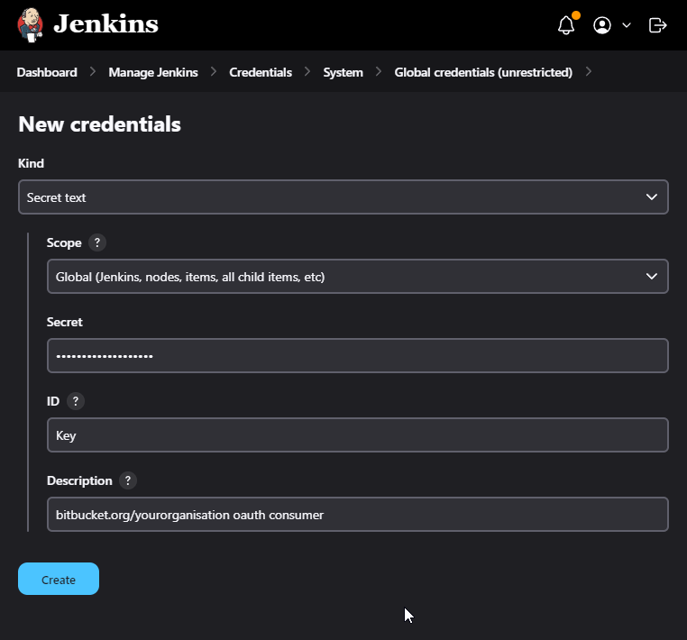
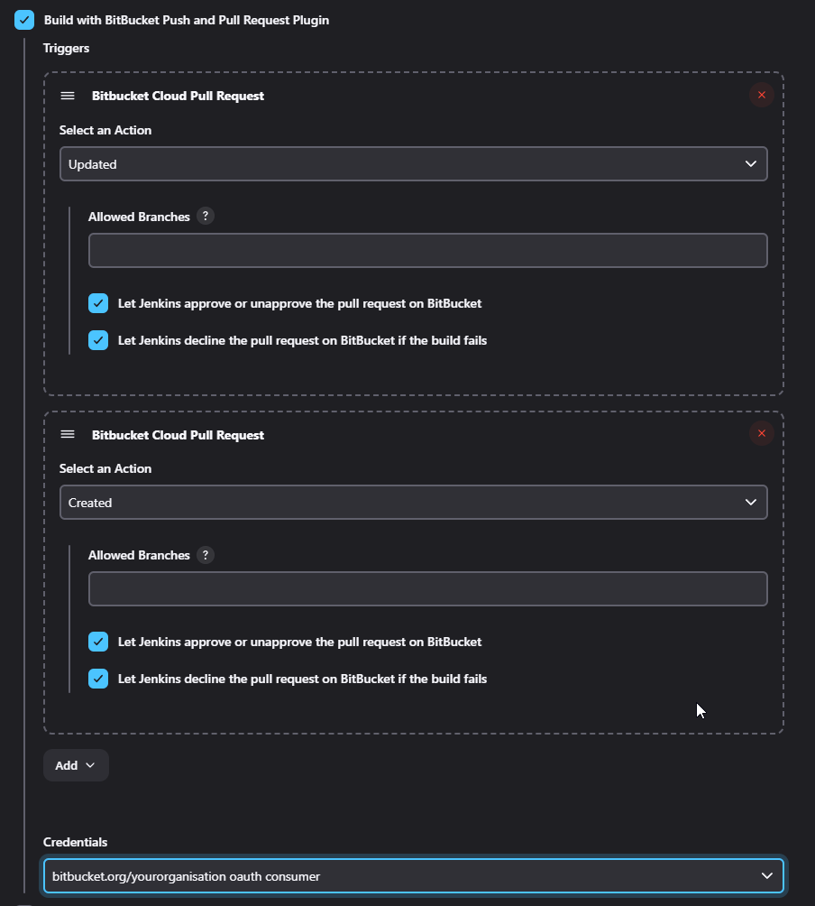

## Warning
This info is not created by the maintainer of the package. It is how I got it working by trial, error and looking at the code

## Background
* [Atlassian support page about Oauth Consumers](https://support.atlassian.com/bitbucket-cloud/docs/use-oauth-on-bitbucket-cloud/)

## Steps

### Create bitbucket.org oauth client

* go to https://bitbucket.org/yourorganisation/workspace/settings/api (cogwheel -> workspace settings -> oauth consumer)
* Add private consumer
  

* Expand the consumer to show key and secret

### Create Jenkins credential

* go to jenkins credential manager https://jenkinsurl/manage/credentials/store/system/domain/_/
* Add credential
* Type : Secret text
* Secret : the Secret from bitbucket oauth consumer
* ID : the Key from bitbucket oauth consumer
* Description : 

### Jenkins Job config

Use the credential in the `Build with Butbucket Push and Pull Request Plugin` trigger

